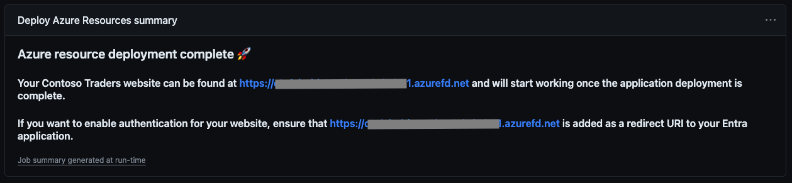

# Creating an application registration

In order to allow users to sign in to your demonstration website, you'll need to create an application in Entra ID. You can do this by running on the following command on az CLI:

```
az ad app create \
    --display-name "ChaosTesting-DemoWebsite" \
    --sign-in-audience "AzureADMyOrg" \
    --web-redirect-uris "https://replace-me-later.com" \
    --enable-access-token-issuance \
    --required-resource-accesses '[{"resourceAppId":"00000003-0000-0000-c000-000000000000","resourceAccess":[{"id":"e1fe6dd8-ba31-4d61-89e7-88639da4683d","type":"Scope"}]}]'
```

### Redirect URL
You'll need to replace the value for the Redirect URL on this application after you successfully deploy your application. This is the location to which Entra ID redirects after performing the authentication step. The correct value for this is shown in Github actions after running the deployment: 



You can update your redirect URL through the portal, or by using the following CLI command, including the application id returned earlier: 
```
az ad app update \
    --id <application-id> \
    --web-redirect-uris "https://my-new-url.azurefd.net"
```

### Notes
- The application above has the --implicit-flow flag enabled. This allows the application to retrieve an access token from the authorization endpoint (implicit grant flow). More information can be found [here](https://learn.microsoft.com/entra/identity-platform/v2-oauth2-implicit-grant-flow). 
- The values for 'required-resource-accesses' represent the User.Read scope, allowing the application to retrieve the basic user profile. The user will have to consent to the application receiving this scope upon the first login. 