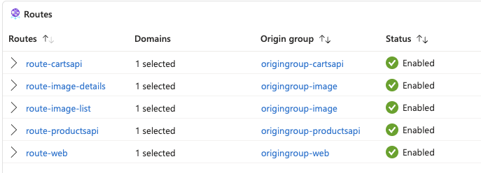
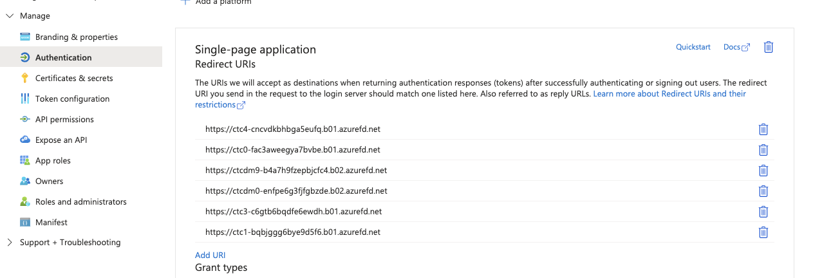

# Contoso Traders Chaos Testing - Architecture

# Component Overview
The application consists of the following components

## Front Door Ingress layer
Front Door is used to provide a single endpoint for incoming requests, while serving various paths to different backend components. The following routes are implemented:

All backend requests go over Internet and are secured using TLS. 

## Frontend website (SPA)
The website is written as a React Single Page application. It is served from a static website on a storage account. All calls to APIs are sent directly from the webpage. 

## Products API (AKS and SQL Server)
The product data is served from the Products API on AKS, while procuct data is stored in a SQL database. Product Images are not stored here, those come from the image storage account. 

TLS certificates on AKS are provided by LetsEncrypt. 

## Carts API (ACA and CosmosDB)
When a user adds an item to their cart, this is stored in the CosmosDB Carts database. Requests are sent to the Carts API, running as an application on Azure Container Apps. 
During deployment an empty (Hello World) image is deployed to ACA, because it cannot be empty. After resource deployment, the actual image from the Container Registry is retrieved. 

## Product images and details on storage
Product images and details are stored on static websites on storage accounts and directly included in the website.

## Entra ID for authentication
Users can authenticate on the website, although this is not needed to browse items. It currently only serves to retrieve a user identifier for storing carts. If the user is not authenticated, carts data is only stored locally in the browser. 

In order for authentication to work, an Entra Application must be created. The ID of this application must be passed to the deployment in the WEBSITE_CLIENTID variable. Additionally, the URL of the application (shown on the deployment summary page) needs to be added to the application as a redirect URI for authentication:

# Architecture Diagram

