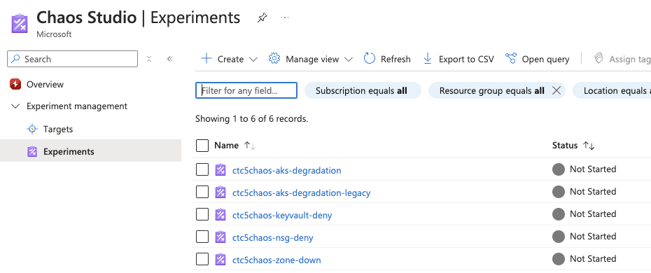
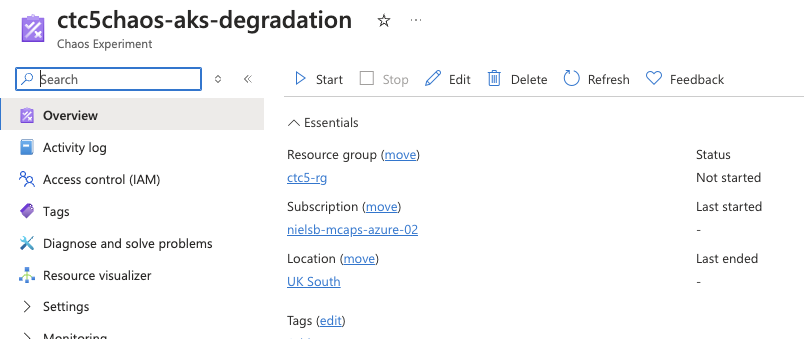

# Getting Started with Chaos Experiments

This application is deployed together with several Chaos Experiments. These can be started after deployment and will affect the Contoso Traders application. 

> [!TIP]
> The list of chaos experiments included in the repo is limited but ever expanding. In case you are missing specific experiments, we highly recommend (and appreciate) creating a Pull Request to include them. Refer to the [Chaos Contributing Guide](./chaos-contributing.md) for more. For a complete list of the available faults, refer to the [Chaos Studio Fault Library](https://learn.microsoft.com/azure/chaos-studio/chaos-studio-fault-library).

## Current Chaos Experiments

The following experiments are included in the repo:

### Adding an NSG Firewall Rule

### Simulated Zone shutdown

### AKS Degradation

### Disable VMSS Node

### Keyvault Deny Access


## Running Chaos Experiments
Experiments can be started from the Azure Portal, or through CLI commands. The [CLI command](https://learn.microsoft.com/azure/chaos-studio/chaos-studio-tutorial-service-direct-cli) uses a direct REST call to the Azure management API as follows:

```
az rest --method post --uri https://management.azure.com/subscriptions/$SUBSCRIPTION_ID/resourceGroups/$RESOURCE_GROUP/providers/Microsoft.Chaos/experiments/$EXPERIMENT_NAME/start?api-version=2023-11-01
```

To get started, running the experiment from the portal is easier. Navigate to Chaos Studio (try typing 'Chaos Studio' in the search bar)

Inside Chaos Studio, you will find the link to the  'experiments' blade on the left side, which will show the available experiments:



From the Experiment page, you can then start the experiment and observe the status
