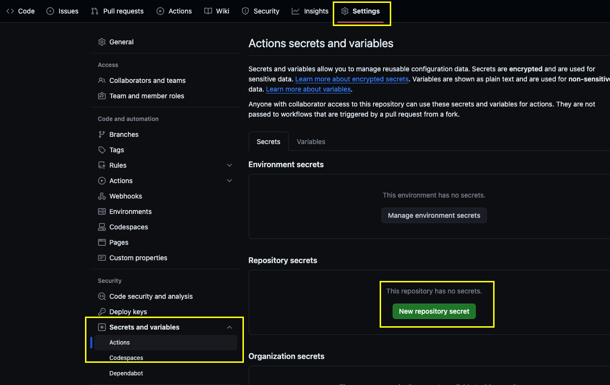

# Generating Deployment Credentials

The solution is deployed using Github Actions. Tasks that require access to your Azure subscription need to run in the security context of a service principal, which is assigned a role on the subscription. 

To create an identity for your deployments, create a service principal as follows. For app name, you can use any name, e.g. 'ChaosTesting-GithubDeployment'

```shell
az ad sp create-for-rbac --name {app-name} --role owner --scopes /subscriptions/{subscription-id}
```

The command will result in an output, such as the following: 

```
{
  "appId": "[REDACTED]",
  "displayName": "ChaosDemo-GithubDeployment",
  "password": "[REDACTED]",
  "tenant": "[REDACTED]"
}
```
> WARNING:
> **These values will allow anyone to read or modify your Azure subscription. Treat your client secrets with care to prevent leaks. Unauthorized disclosure can compromise security. Store secrets securely and share only with authorized recipients. It is recommended to discard the plaintext clientsecret after storing it in Github.**

Your Github credential needs to be formatted in the following way. Copy the values from the output above (clientSecret=password, clientId=appId, tenantId=tenant).

```
{
      "clientId": "<Client ID>",
      "clientSecret": "<Client Secret>",
      "subscriptionId": "<Subscription ID>",
      "tenantId": "<Tenant ID>"
}
```

This value needs to be stored securely in Github. For this, Github repositories have a secret store. Save the JSON structure above as a secret called ``AZURE_CREDENTIALS``. 

