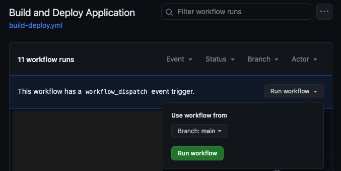

# Chaos Testing Demo - Deployment Guide

This document describes the steps necessary to deploy the demo solution to your own environment.

## Pre-requisites

1) You need an Azure subscription, to which you can deploy resources. Specifically, you need to execute a subscription-level resource deployment. 

0) You need your own Github repo to work in. Easiest is to fork this repo by clicking _fork_ on the top right of the repo homepage. This will create a copy in your own Github account. 

0) You need a service principal that you can use for running pipeline actions against your Azure subscription, such as creating and modifying Azure resources. This service principal requires _owner_ permissions, since it will also need to set role assignments during the deployment.  The required steps are described [here](./deployment-credentials.md).

0) If you want the users of your demo solution to log in to the website, you'll need an Entra ID application registration. The required steps are described [here](./app-registration.md). Note that this step is optional. If you don't want users to sign in or don't have permissions to create an application, this step may be omitted. 

## Deployment Steps
1) Ensure the pre-requisites above have been met. This means that your own repo has been set up and subscription access is in place. 

0) For the deployment to run successfully, several variables need to be set. These are defined in the _Secrets and Variables_ section of the _Settings_ page on your repo. Please define the variables listed in the **Github Deployment Variables** section at the bottom of this page. 

0) Once the variables have been added, it's time to start the show. This means running your Github deployment workflow for the first time. On the repo page, click _Actions_ in the top menu. From the left, select the _Build and Deploy Application_ workflow. Expand the _Run workflow_ button and click on the green button. 

0) When all the tasks have completed without errors (i.e. all the checkboxes are green on the deployment page), your application is ready for use. The URL is listed on the deployment summary page. Remember that if you have authentication enabled on the website, you'll need to add this URL to the application registration in Entra ID. Instructions can be found [here](./app-registration.md).

## Github Deployment Variables

| Variable | Example value | Description |
|:-------------|:--------------|:------------|
| DEPLOYMENT_NAME | cntr01 | Name prefix that will be used for resources. 3-6 chars alfanumeric, lowercase |
| DEPLOYMENT_REGION | uksouth | Azure region to which resources will be deployed |
| DEPLOYMENT_ZONES | false | Set to _true_ to enable Availability Zone deployment on all resources. Not recommended for test/demo workloads, unless you specifically want to test the zone-down scenario with an experiment.|
| DEPLOYMENT_CHAOS | true | Set to _true_ to deploy Chaos Experiments as part of the resource deployment. |
| WEBSITE_CLIENTID |  142f551e-de3f-4b6c-ba6b-f6a80e69aae0 | Application (client) id of the Entra ID application used for website logins (disabled if value omitted)|

## Next Steps
Now that your demo application has been deployed, there's several things you can do next. 

#### Explore the application 
Review the architecture of the demo application [here](./architecture.md). You can browse the website by finding the URL on the deployment summary page. 

#### Making changes
You're free to further develop this application to better suit your needs. In case you want to deploy the Bicep files locally rather than in a Github workflow, be sure to read the guide on [local deployments](./local-deployment.md).

#### Run Chaos Experiments
There's a good chance you landed on this project because you're involved in Chaos Engineering. To get started, refer to the instructions [here](./chaos-getting-started.md). 

#### Contributing Chaos Experiments
Additionally, we'd love to see the experiments you've designed for this application. You can read the instructions on how to contribute them [here](./chaos-contributing.md). 

## Troubleshooting
#### Naming conflicts
Resource names are defined based on the _DEPLOYMENT_NAME_ variable. This name needs be globally unique, since it refers to the name of resources available on the Internet (e.g. storage account names). If you or someone else has a deployment in place that has the same name prefix, an error will occur. Set a more unique name in the variable and retry. 